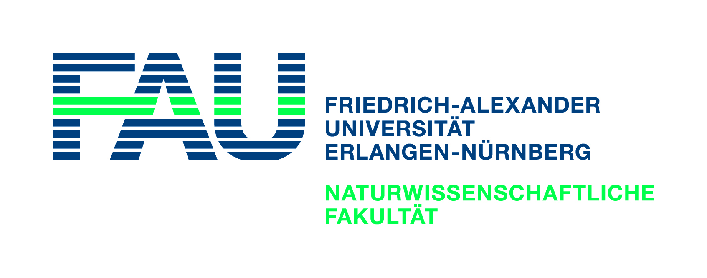

<div style="border-bottom:none;">
<div align="center">

<h1>Mathematical Data Science - Final Project<h1>
<h1>Reinforcement Learning for playing Connect Four<h1>
</div>
</div>

## Motivation
Reinforcement learning of Connect4 against the famous Minimax algorithm

## Getting Started

Clone the repository, to get our Notebooks, Presentation and Project Report.

```
git clone https://github.com/Mavengence/DQL_Connect4_Mathematical_Data_Science_SS2020.FAU.git
```

### Links to Ressources

- Connect4 as [Python](https://github.com/Mavengence/DQL_Connect4_Mathematical_Data_Science_SS2020.FAU/blob/master/code/connect4.py)
- Final Presentation as [PDF](https://github.com/Mavengence/DQL_Connect4_Mathematical_Data_Science_SS2020.FAU/blob/master/presentation/Presentation.pdf)
- Final Paper as [PDF](https://github.com/Mavengence/DQL_Connect4_Mathematical_Data_Science_SS2020.FAU/blob/master/paper/Paper.pdf)

### Run the Notebook

```
cd/you_cloned_repo_location jupyter notebook

python connect4.py
```

- You start the training process with the connect4.py
- You start the GUI by calling play_gui() at the end of the file
- You need to select the depth of the Minimax and the Episodes at the end of the file

### Deployment

Just pull the repo, if you wanna change sth you can ask :)

## Authors

* **Tim Löhr** - [GitHub Mavengence](https://github.com/Mavengence)
* **Florian Cimander** - [GitHub flocimander](https://github.com/flocimander)
* **Simon Hölck**

## License
I used the Minimax from here:
https://github.com/KeithGalli/Connect4-Python

Pretty much the BSD license, just don't repackage it and call it your own please!
Also if you do make some changes, feel free to make a pull request and help make things more awesome!
